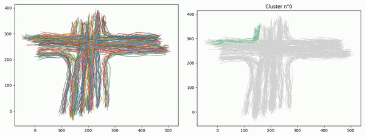

# PyFastClustering
Python Fast Trajectories Clustering



## Set-up

- Install the required packages
    - `pip install -r requirements.txt`
    
    
## Logs

Hu Distance
```
Namespace(data='ds/cross.mat', distance_function='hu', fixed_length=100, flow=False, 
          flow_th=0.0, method='kmeans', n_cluster=15, num_samples=300, save_pics=False, sigma=15)

Compute similarity matrix: 100%|██████████| 300/300 [00:00<00:00, 363.00it/s]

Homogeneity: 0.903
Completeness: 0.995
V-measure: 0.947
```

Hausdorff Distance
```
Namespace(data='ds/cross.mat', distance_function='hausdorff', fixed_length=0, flow=True, 
          flow_th=0.0, method='kmeans',    n_cluster=15, num_samples=300, save_pics=False, sigma=15)

Trajectories to flows: 100%|██████████| 1900/1900 [00:00<00:00, 6900.17it/s]
Compute similarity matrix: 100%|██████████| 300/300 [00:01<00:00, 265.01it/s]

Homogeneity: 0.869
Completeness: 0.966
V-measure: 0.915
```

LCSS Distance
```
Namespace(data='ds/cross.mat', distance_function='lcss', fixed_length=30, flow=False, 
          flow_th=0.0, method='kmeans', n_cluster=15, num_samples=300, save_pics=False, sigma=15)

Compute similarity matrix: 100%|██████████| 300/300 [00:42<00:00,  7.26it/s]

Homogeneity: 0.894
Completeness: 0.987
V-measure: 0.939
```

